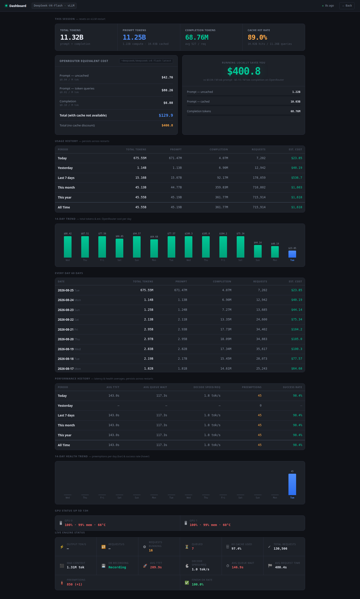

# vLLM Dashboard

A single-page, self-hosted usage/cost/health dashboard for a local **vLLM** (or **SGLang**) OpenAI-compatible server. Scrapes the server's own Prometheus `/metrics` endpoint — no changes to your inference server required.



## What it shows

- **This session** — live token counts, prompt cache hit rate, and an OpenRouter cost comparison (with/without your cache hit rate), since the vLLM process started.
- **Usage history** — Today / Yesterday / Last 7 days / This month / This year / **All time**, with token counts and estimated cost, persisted in SQLite so it survives restarts.
- **Every day** — a full per-day token + cost table since the dashboard started recording, plus a 14-day bar chart.
- **Performance history** — average time-to-first-token, average queue wait, decode speed, preemptions, and success rate, broken down by the same periods — also persisted, not just live.
- **GPU status** — utilization, memory, temperature, and power draw per GPU (via `nvidia-smi`), plus container uptime.
- **Live engine status** — output tokens/sec, requests/sec, running/queued requests, KV cache usage, and more, refreshed every 10s.

Cost estimates are computed by fetching **live pricing from the OpenRouter API** for a model you configure, and pricing cached vs. non-cached prompt tokens separately — not a hardcoded rate.

## Why

Self-hosting an LLM makes cost and performance invisible unless you build something to show it. This started as an internal tool for tracking a vLLM deployment day-to-day (what would this be costing on OpenRouter, is the server under memory pressure, why did latency spike) and grew from there.

## Setup

```bash
pip install -r requirements.txt

# point at your vLLM/SGLang server's Prometheus metrics endpoint (default shown)
export SGLANG_METRICS_URL=http://127.0.0.1:8000/metrics

# the OpenRouter model id to compare cost against (see https://openrouter.ai/models)
export OPENROUTER_MODEL=deepseek/deepseek-chat

uvicorn app:app --host 0.0.0.0 --port 8765
```

Open `http://localhost:8765/`.

### Optional environment variables

| Variable | Default | Purpose |
|---|---|---|
| `SGLANG_METRICS_URL` | `http://127.0.0.1:8000/metrics` | Your server's Prometheus metrics endpoint |
| `OPENROUTER_MODEL` | `deepseek/deepseek-chat` | Model id to price against on OpenRouter |
| `METRICS_DB` | `./metrics.db` | SQLite file for history |
| `METRICS_POLL_INTERVAL` | `30` | Seconds between metric polls |
| `VLLM_CONTAINER` | `vllm` | Docker container name, for the uptime chip (optional — only used if you run vLLM in Docker) |

GPU status requires `nvidia-smi` on the host the dashboard process runs on; it degrades to "unavailable" gracefully if missing.

## Architecture

- `metrics.py` — scrapes the Prometheus text format, maps both vLLM and SGLang metric names (tries several candidate names per field so it works with either), records cumulative counters into SQLite every poll, and derives period/daily deltas from them. Also fetches OpenRouter pricing (cached 1h) and `nvidia-smi` GPU stats.
- `app.py` — a small FastAPI app exposing `/vllm-api/all` (the aggregate JSON the frontend polls) and serving the static frontend.
- `static/index.html` — the frontend. No build step, no framework — plain HTML/CSS/JS, polls `/vllm-api/all` every 10s.

## License

MIT — see [LICENSE](LICENSE).
